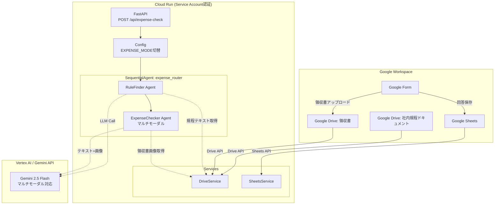
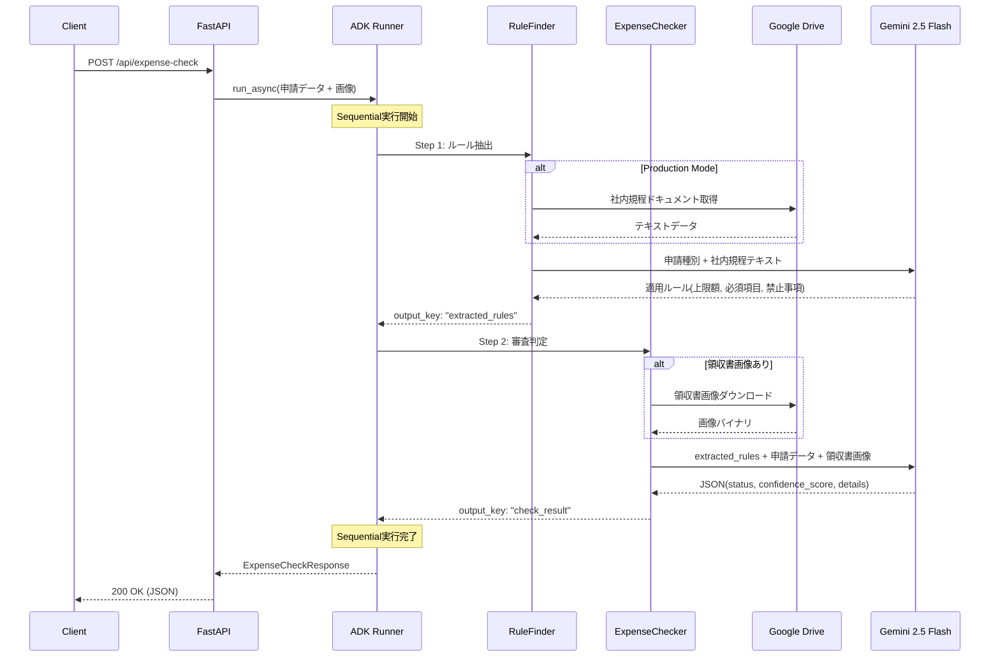

# 経費精算マルチエージェントシステム

Google ADK + FastAPI + Docker による経費精算の自動審査APIシステム。  
Cloud Run へのデプロイに最適化。マルチモーダル対応（領収書画像読み取り）。

## 動作モード

| モード | 環境変数 `EXPENSE_MODE` | 説明 |
|---|---|---|
| **demo** | `demo`（デフォルト） | ハードコードルール、APIキー認証、画像読み取りなし |
| **production** | `production` | Drive/Sheets連携、Vertex AI、サービスアカウント認証、領収書画像OCR |

## アーキテクチャ



## エージェント処理フロー



## ディレクトリ構成

```
expense-agent-workflow/
├── docker-compose.yml
├── docker/
│   ├── dev.Dockerfile          # 開発用（ホットリロード）
│   └── prod.Dockerfile         # 本番用（マルチステージビルド）
├── requirements.txt
├── requirements-dev.txt
├── pyproject.toml
├── src/
│   ├── config.py               # 環境変数ベースの設定管理
│   ├── main.py                 # FastAPI アプリケーション
│   ├── schemas.py              # Pydantic スキーマ
│   ├── agents/
│   │   ├── rule_finder.py      # 社内規程ルール抽出エージェント
│   │   ├── expense_checker.py  # 審査判定エージェント（マルチモーダル）
│   │   └── router.py           # SequentialAgent パイプライン
│   └── services/
│       ├── drive.py            # Google Drive API クライアント
│       └── sheets.py           # Google Sheets API クライアント
├── tests/
│   ├── test_config.py
│   ├── test_schemas.py
│   ├── test_rule_finder.py
│   ├── test_expense_checker.py
│   ├── test_router.py
│   ├── test_main.py
│   ├── test_drive.py
│   └── test_sheets.py
└── .kiro/
    ├── agents/expense-agent.json
    └── hooks/lint-and-format.sh
```

## セットアップ

### 前提条件

- Docker & Docker Compose
- **demo モード:** Google API Key
- **production モード:** GCP プロジェクト + サービスアカウント

### ローカル開発（demo モード）

```bash
# 環境変数を設定
export GOOGLE_API_KEY=your-api-key
export EXPENSE_MODE=demo

# コンテナ起動（ホットリロード有効）
docker compose up
```

### Production モード設定

```bash
export EXPENSE_MODE=production
export GOOGLE_CLOUD_PROJECT=your-project-id
export GOOGLE_CLOUD_LOCATION=asia-northeast1
export DRIVE_RULES_FILE_ID=your-rules-doc-file-id
export DRIVE_RECEIPTS_FOLDER_ID=your-receipts-folder-id
export SHEETS_FORM_RESPONSES_ID=your-spreadsheet-id

# サービスアカウント認証（ローカル開発時）
export GOOGLE_APPLICATION_CREDENTIALS=/path/to/service-account.json

docker compose up
```

### テスト実行

```bash
pytest tests/ -v
```

### Lint / Format

```bash
ruff check src/ tests/
ruff format src/ tests/
```

## 環境変数一覧

| 変数名 | 必須 | デフォルト | 説明 |
|---|---|---|---|
| `EXPENSE_MODE` | - | `demo` | 動作モード (`demo` / `production`) |
| `GOOGLE_API_KEY` | demo時 | - | Gemini API キー |
| `GOOGLE_CLOUD_PROJECT` | production時 | - | GCPプロジェクトID |
| `GOOGLE_CLOUD_LOCATION` | - | `asia-northeast1` | GCPリージョン |
| `DRIVE_RULES_FILE_ID` | - | - | 社内規程ドキュメントのDriveファイルID |
| `DRIVE_RECEIPTS_FOLDER_ID` | - | - | 領収書フォルダのDrive ID |
| `SHEETS_FORM_RESPONSES_ID` | - | - | Formの回答スプレッドシートID |
| `GOOGLE_APPLICATION_CREDENTIALS` | production時(ローカル) | - | サービスアカウントJSONパス |

## API仕様

### POST /api/expense-check

**リクエスト:**

```json
{
  "type": "社内懇親会",
  "amount": 24000,
  "count": 6,
  "participants_raw": "田中太郎、山田花子、佐藤一郎、鈴木次郎、高橋三郎、伊藤四郎",
  "purpose": "チームビルディング",
  "receipt_url": "https://drive.google.com/file/d/FILE_ID/view"
}
```

**レスポンス:**

```json
{
  "status": "承認",
  "confidence_score": 4.5,
  "details": {
    "per_person_amount": 4000,
    "limit_amount": 5000,
    "required_items_check": "全員の氏名あり",
    "prohibition_check": "該当なし",
    "receipt_check": "宛名: 株式会社テスト、金額一致、日付妥当"
  },
  "rejection_reason": null
}
```

## 社内規程（demo モードの組み込みルール）

| カテゴリ | 1人あたり上限 | 必須項目 |
|---|---|---|
| 社内懇親会 | 5,000円 | 全員の氏名 |
| 社外接待 | 10,000円（役員同席時15,000円） | 取引先名、目的 |

**禁止事項:** 領収書の宛名「上様」は一切不可

## Cloud Run デプロイ

### デプロイスクリプトを使用（推奨）

`adk deploy cloud_run` コマンドでサービスアカウント付きデプロイを行います。

```bash
# .envファイルを作成
cat > .env << EOF
GOOGLE_CLOUD_PROJECT=your-project-id
GOOGLE_CLOUD_LOCATION=asia-northeast1
DRIVE_RULES_FILE_ID=your-rules-doc-id
DRIVE_RECEIPTS_FOLDER_ID=your-receipts-folder-id
SHEETS_FORM_RESPONSES_ID=your-spreadsheet-id
EOF

# デプロイ実行
python deploy_cloudrun.py
```

デプロイスクリプトが自動で行うこと:
1. サービスアカウント `expense-agent@PROJECT_ID.iam.gserviceaccount.com` を作成
2. 必要なIAMロールを付与（Vertex AI, Drive, Cloud Run等）
3. `adk deploy cloud_run` でCloud Runにデプロイ

### 手動デプロイ（Dockerイメージ）

```bash
# イメージビルド
docker build -f docker/prod.Dockerfile -t expense-agent .

# Cloud Run デプロイ
gcloud run deploy expense-agent \
  --image gcr.io/PROJECT_ID/expense-agent \
  --platform managed \
  --region asia-northeast1 \
  --set-env-vars "EXPENSE_MODE=production,GOOGLE_CLOUD_PROJECT=PROJECT_ID,DRIVE_RULES_FILE_ID=xxx,SHEETS_FORM_RESPONSES_ID=yyy" \
  --service-account expense-agent@PROJECT_ID.iam.gserviceaccount.com \
  --allow-unauthenticated
```

### サービスアカウントに必要な権限

- `roles/drive.metadata.reader` (Drive ファイルメタデータ読み取り)
- `roles/drive.readonly` (Drive ファイルダウンロード)
- `roles/aiplatform.user` (Vertex AI Gemini 呼び出し)

## 技術スタック

| 項目 | 技術 |
|---|---|
| フレームワーク | FastAPI 0.115 |
| AIエージェント | Google ADK 1.5 (SequentialAgent) |
| LLM | Gemini 2.5 Flash（マルチモーダル） |
| バリデーション | Pydantic 2.11 |
| 設定管理 | pydantic-settings |
| Google API | google-api-python-client (Drive, Sheets) |
| 認証 | google-auth（サービスアカウント / APIキー） |
| サーバー | Uvicorn 0.34 |
| コンテナ | Docker (python:3.13-slim) |
| デプロイ先 | Google Cloud Run |
| Linter/Formatter | Ruff |
| テスト | pytest + pytest-asyncio + httpx |
