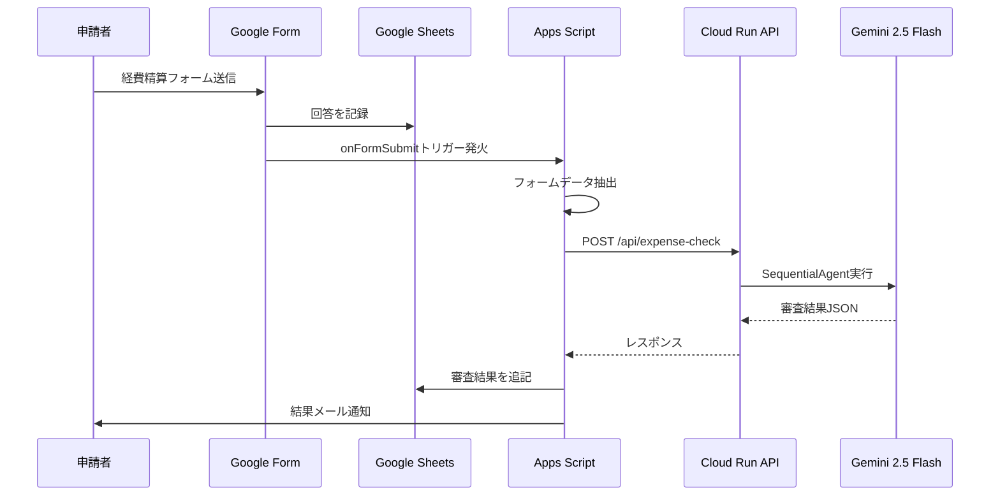

# Google Apps Script セットアップガイド

Google FormからCloud Run APIを自動呼び出しする設定手順です。

## 構成図



## 手順

### 1. Google Formを作成

以下の質問を設定します:

| # | 質問タイトル | 形式 | 説明 |
|---|---|---|---|
| 1 | 申請種別 | プルダウン | 選択肢: 社内懇親会, 社外接待 |
| 2 | 合計金額 | 記述式（短文） | 半角数字で入力（例: 24000） |
| 3 | 参加人数 | 記述式（短文） | 半角数字 |
| 4 | 参加者氏名 | 段落 | 全員の氏名（読点区切り） |
| 5 | 目的 | 記述式（短文） | 経費の利用目的 |
| 6 | 領収書 | ファイルアップロード | 画像（JPG/PNG）、1ファイル |

**設定:**
- 「メールアドレスを収集する」を有効にする（結果通知のため）

### 2. スプレッドシートにGASを追加

1. フォームの回答タブ > 「スプレッドシートにリンク」
2. スプレッドシートを開く
3. **拡張機能 > Apps Script**
4. `form_trigger.gs` の内容をコピー&ペースト

### 3. スクリプトプロパティを設定

Apps Scriptエディタで:
1. ⚙️ プロジェクトの設定
2. 「スクリプトプロパティ」セクション
3. 以下を追加:

| プロパティ | 値 |
|---|---|
| `API_URL` | `https://expense-agent-xxxxx-an.a.run.app`（Cloud RunのURL） |

### 4. トリガーを設定

Apps Scriptエディタで `setupTrigger` 関数を1回実行します。

または手動で:
1. ⏰ トリガー（時計アイコン）
2. 「トリガーを追加」
3. 関数: `onFormSubmit`
4. イベント: スプレッドシートから > フォーム送信時

### 5. 動作確認

1. `testApiConnection` 関数を実行してAPI疎通確認
2. フォームからテスト送信
3. スプレッドシートに審査結果が追記されることを確認

## Cloud Runの認証設定

### 公開アクセス（テスト/デモ用）

```bash
gcloud run deploy expense-agent ... --allow-unauthenticated
```

GASの `getAuthHeaders_()` で空オブジェクトを返す（デフォルト）。

### 認証あり（本番推奨）

```bash
gcloud run deploy expense-agent ... --no-allow-unauthenticated
```

GASは `ScriptApp.getIdentityToken()` で自動的にIDトークンを取得します。
Cloud Runのサービスに対してGASプロジェクトのサービスアカウントに
`roles/run.invoker` を付与してください:

```bash
gcloud run services add-iam-policy-binding expense-agent \
  --member="serviceAccount:YOUR_GAS_PROJECT@appspot.gserviceaccount.com" \
  --role="roles/run.invoker" \
  --region=asia-northeast1
```

## ファイル構成

```
gas/
├── form_trigger.gs    # メインGASスクリプト
└── README.md          # このファイル
```

## トラブルシューティング

| 問題 | 対処 |
|---|---|
| API_URLが未設定エラー | スクリプトプロパティに設定 |
| 403 Forbidden | Cloud Runの認証設定を確認 |
| 500 Internal Server Error | Cloud Runのログを確認（GOOGLE_API_KEY等） |
| メールが届かない | フォームで「メールアドレス収集」が有効か確認 |
| トリガーが発火しない | setupTrigger()を再実行 |
